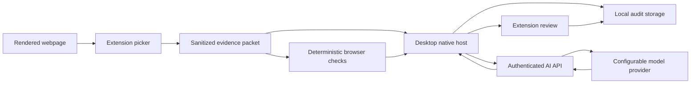

# AI-assisted browser evidence

## Product outcome

The Chrome extension shortens the slowest part of an accessibility audit:
turning an observed barrier into consistent, reviewable evidence. An auditor
selects an element or visual region, explains the problem in their own words,
reviews the exact data that may be sent for generation, and receives a
structured finding draft. The desktop application remains the system of record.

This is human-guided finding authoring, not automated conformance
certification. Deterministic results and captured facts remain distinguishable
from model suggestions, and no model output becomes a confirmed finding without
an explicit user action.

## Current implementation status

The production foundation is implemented across all three runtimes:

- Shared evidence, draft, WCAG, and native-message contracts with bounded
  runtime validation and tests.
- Chrome quick-capture popup, optional expanded side-panel workspace, on-demand
  isolated picker, element and region selection, marked high-DPI crop,
  deterministic checks, payload controls, local recovery, complete structured
  draft editing, and Markdown export.
- Electron native-host registration, exact extension-ID allowlisting, audit
  discovery, authenticated generation forwarding, local evidence persistence,
  `FindingV2`, and rich finding/evidence review.
- Device-authenticated web generation with explicit consent, per-account limits,
  metadata-only accounting, structured model output, WCAG normalization, and
  safe provider failure handling.

Chrome Web Store submission, finalized store privacy disclosures, signed
extension artifacts, interactive screenshot redaction, and the physical
macOS/Windows installer matrix remain release-hardening work. Screenshot
omission is already available before generation.

## Primary journey

1. Open the TheWCAG toolbar popup on the page being audited.
2. Start **Mark an issue** and select an element or drag a visual region. The
   background worker completes capture even after Chrome closes the popup.
3. Reopen the popup when its badge indicates that evidence is ready, then open
   the expanded side-panel workspace.
4. Connect to the installed desktop application and choose an active audit.
5. Capture a clean viewport image and a contextual high-DPI screenshot with the selected target clearly highlighted.
6. Record rendered element context, accessibility properties, relevant styles,
   page context, deterministic checks, and non-destructive marker geometry.
7. Add a short auditor observation and optional task context.
8. Review the evidence payload, omit any sensitive section, and explicitly
   approve AI processing. Interactive screenshot redaction follows during
   release hardening.
9. Generate a schema-constrained draft with title, description, actual result,
   expected result, impact, affected users, severity, WCAG mapping,
   recommendation, example fix, reproduction steps, and confidence.
10. Review or edit each field. Low-confidence fields stay visibly unresolved.
11. Confirm and save the evidence plus finding into the selected local audit.

If the desktop application is unavailable, the extension still supports local
capture and PNG or Markdown export. AI generation and audit persistence require
a connected authenticated desktop application in the first release.

## System boundaries

### Browser extension

- Manifest V3 with `activeTab`, `scripting`, `sidePanel`, `storage`, and
  `nativeMessaging` only.
- No persistent access to every website and no remote executable code.
- A service worker owns privileged Chrome API calls.
- The toolbar popup owns capture initiation and ready-state handoff. The side
  panel is an optional expanded workspace for review, payload omission, draft
  editing, and recovery. Interactive redaction is part of release hardening.
- A short-lived isolated picker is injected only after a user gesture.
- Page content and messages from the picker are always treated as untrusted.

### Desktop application

- Registers an allowlisted native messaging host during installation.
- Validates every message with shared versioned contracts and strict size caps.
- Owns the device credential, active audit selection, local evidence, findings,
  retries, and authenticated requests.
- Never gives the extension its bearer token or arbitrary file access.
- Supports a bounded `FindingV1` to `FindingV2` compatibility layer.

### Web service

- Adds a device-authenticated structured finding endpoint.
- Applies request limits, rate limits, plan limits, schema validation, and safe
  timeouts before invoking a provider.
- Uses a versioned WCAG reference set and a strict JSON response schema.
- Stores usage metadata without screenshots, DOM excerpts, observations, or
  generated finding content.
- Redacts request bodies and model responses from application logs.

## Shared contracts

All cross-process values use plain JSON and include `schemaVersion`.

### `EvidencePacketV1`

- Evidence ID, capture timestamp, capture mode, and audit ID.
- Page title, sanitized URL, origin, browser, viewport, zoom, locale, and color
  scheme.
- Target bounds and non-destructive marker geometry.
- Stable selector candidates and a fallback structural path.
- Tag, role, accessible name, description, state, labels, safe attributes,
  nearby heading, parent landmark, and a bounded sanitized DOM excerpt.
- A small allowlist of relevant computed styles.
- Clean image dimensions, crop dimensions, MIME type, and bounded data URL.
- Auditor observation, optional task context, deterministic results, omissions,
  and explicit consent timestamp.

### `AiFindingDraftV1`

- Title and concise problem description.
- Actual and expected results.
- User impact and affected-user categories.
- Suggested severity and severity rationale.
- WCAG 2.2 criteria with level, rationale, and confidence.
- Suggested resolution and optional implementation example.
- Reproduction steps.
- Overall confidence, field-level confidence, assumptions, and manual checks.
- Provider-neutral model, prompt, and knowledge-base version metadata.

### `FindingV2`

- Preserves all existing finding fields.
- Adds the structured draft fields, evidence ID, source, confidence metadata,
  authoring state, last-modified time, and AI provenance.
- Reads existing findings without migration failures and writes only the new
  version after a user edits or saves them.

## Screenshot and target accuracy

- Capture the current visible tab only after an explicit extension action.
- Preserve the clean screenshot and render markers from saved geometry.
- Convert CSS pixels using `devicePixelRatio`, browser zoom, and
  `visualViewport` offsets.
- Add bounded context padding without exceeding the captured viewport.
- Verify crops at 80%, 100%, 125%, 150%, 175%, and 200% browser zoom and at
  device scale factors 1 and 2.
- Mark cross-origin frames, closed shadow roots, browser-owned pages, and
  off-viewport targets as explicit limitations instead of guessing.

## Safe element context

Allowed context includes tag names, semantic roles, accessible names, ARIA
state, labels, headings, landmarks, safe selectors, a short sanitized excerpt,
and styles relevant to the observed barrier. Original framework component names,
source files, and repository code are not claimed unless the audited application
deliberately exposes them.

The extractor must never collect:

- Passwords or current values from inputs, textareas, selects, or contenteditable
  regions.
- Cookies, local storage, session storage, authentication headers, network
  bodies, clipboard contents, or browser history.
- Hidden page content outside the selected element context.
- URL credentials, fragments, or query parameters by default.
- Event-handler source, inline scripts, or executable page content.

## AI behavior

- The deterministic layer supplies facts; the model supplies a draft.
- Webpage text is delimited as untrusted evidence and cannot alter model
  instructions.
- The service rejects unstructured output and retries once with a repair prompt.
- Missing evidence produces `needsManualCheck`, never invented certainty.
- WCAG mappings come from a versioned allowlist and are server-validated.
- Severity is a suggestion based on task impact, reach, and workaround, then
  confirmed by the auditor.
- Regeneration can target a single field so user edits elsewhere are preserved.
- No draft is automatically published, exported, or marked confirmed.

## Privacy and consent

- Evidence remains local until the auditor opens the payload review and chooses
  **Generate draft**.
- The review shows the exact screenshot, observation, URL, and element context
  that will leave the device.
- Users can omit the screenshot, remove text context, withhold the page address,
  or cancel. Interactive crop adjustment and redaction are release-hardening
  work; the picker limits capture to a bounded context around the selected target.
- The consent timestamp and selected payload sections are recorded locally.
- Transport uses HTTPS; device tokens stay in OS secure storage.
- Provider retention and training controls must be configured contractually and
  documented before production enablement.

## Delivery phases

### Phase 1: contracts and local capture

- Add shared runtime-validated contracts and fixtures.
- Add the extension workspace, Manifest V3 build, toolbar popup, expanded side
  panel, and service worker.
- Implement keyboard-accessible element selection and region selection.
- Capture the viewport, calculate bounded contextual crop geometry, and display the highlighted evidence.
- Add observation, task context, payload visibility, and local draft persistence.
- Add deterministic local draft generation so the flow remains testable without
  credentials or a model provider.

Exit criteria: a user can mark an element, inspect the exact captured payload,
and export a structured local draft without the desktop or network.

### Phase 2: desktop bridge and audit persistence

- Implement the native messaging protocol and installer registration for macOS
  and Windows.
- Pair only with the published extension ID, with a development ID override.
- Expose active audits and accept bounded evidence packets.
- Add local evidence storage, `FindingV2`, migrations, activity records, and
  review UI.
- Add reconnect, timeout, duplicate-message, and version-mismatch handling.

Exit criteria: a confirmed extension draft appears in the chosen desktop audit
with its editable screenshot evidence.

### Phase 3: AI authoring service

- Add the authenticated API, provider adapter, prompt and knowledge versions,
  strict response schema, rate limits, usage accounting, and privacy-safe logs.
- Add field-level confidence, single-field regeneration, cancellation, and
  understandable errors.
- Add prompt-injection, malformed-response, oversized-input, timeout, quota, and
  retry tests.

Exit criteria: a user-approved payload produces a reviewable structured draft
and never changes local audit state before confirmation.

### Phase 4: release hardening

- Complete Chrome Web Store privacy disclosures and permission explanations.
- Add extension icons, screenshots, onboarding, update behavior, and a privacy
  policy linked from the store listing.
- Verify screen-reader, keyboard, zoom, reflow, forced-colors, reduced-motion,
  offline, slow-network, and model-failure paths.
- Verify macOS and Windows native-host registration, upgrade, and uninstall.
- Add signed extension artifacts and CI checks without changing the desktop
  release tag contract.

Exit criteria: the extension passes internal security and accessibility gates,
desktop release validation, and Chrome Web Store review requirements.

## Acceptance criteria

- Installing the extension does not request permanent access to every site.
- Selection begins only from a direct user action and Escape always cancels.
- The entire flow works with keyboard and screen reader at 200% zoom.
- Crops remain aligned within two device pixels across the supported zoom and
  scale matrix.
- Sensitive values are absent from captured context and test fixtures.
- Nothing is transmitted before explicit evidence consent.
- Invalid native messages, selectors, URLs, image formats, model responses, and
  WCAG identifiers are rejected safely.
- A generated field always remains editable and visibly marked as suggested
  until confirmation.
- Existing audits and reports continue to load unchanged.
- Extension failure cannot compromise the sandboxed Electron renderer or expose
  its device token.
- The full test, typecheck, desktop build, web build, and extension build pass in
  CI.

## Initial release boundaries

The first release supports Chrome on macOS and Windows, visible-tab element and
region evidence, WCAG 2.2 A and AA mappings, and one selected finding at a time.
Edge support follows after the Chrome release using the same Chromium codebase.
Full-page stitching, batch crawling, source-repository integration, Jira or
GitHub ticket creation, team synchronization, and autonomous pass or fail claims
remain later work.
