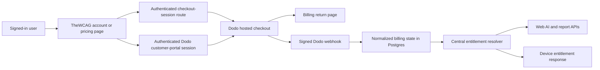

# TheWCAG SaaS and Dodo Payments implementation plan

Status: implemented launch baseline; Dodo test/live catalog credentials and external scheduler remain deployment configuration
Billing provider: Dodo Payments only
Product principle: the complete local audit workflow remains free; customers subscribe only for TheWCAG-operated cloud services.

Implemented on 22 July 2026: additive billing/report migrations, official Dodo TypeScript SDK, hosted checkout, hosted customer portal, signed bounded webhooks, payment-to-user recovery, product/business allowlists, idempotency and ordering, central entitlements, managed-AI/report/analytics/branding enforcement, rate limits, private R2 delivery, subscription reconciliation, grace/retention cleanup, refund/dispute revocation, billing-first account deletion, pricing/account/return/admin/desktop states, legal copy, tests, and [billing operations](BILLING-OPERATIONS.md). The canonical implementation routes are `/api/billing/checkout`, `/api/billing/portal`, `/api/billing/webhooks`, `/billing/return`, and `/api/internal/billing/reconcile`.

## 1. Product decision

Launch with two clear choices, not a matrix of confusing tiers:

| Capability | Free | Pro subscription |
| --- | --- | --- |
| Desktop application and Chrome extension | Included | Included |
| Scoper, templates, guided testing, coverage map, contrast tools, annotations, findings, WCAG review | Included | Included |
| Local Markdown/HTML/image exports and portable audit packages | Included | Included |
| Offline use | Included | Included |
| Local deterministic finding draft | Included | Included |
| Bring-your-own OpenAI, Anthropic, or OpenRouter key | Included | Included |
| TheWCAG managed AI finding drafts | Not included | Included with a transparent usage allowance |
| Hosted, unlisted report links | Not included | Included |
| Hosted report management, view counts, storage, and public image delivery | Not included | Included |
| White-label hosted report branding | Not included | Included |
| Billing portal, invoices, payment-method changes, and cancellation | N/A | Included through Dodo Payments |

The free product must never become a crippled trial. A user must be able to scope, perform, document, review, export, and retain a complete audit without an account or payment. The subscription pays for recurring provider cost: managed model inference, R2 storage, CDN delivery, hosted report availability, analytics, and billing operations.

### Recommended launch offer

- One plan key: `pro`.
- Two Dodo subscription products in one Product Collection: monthly and annual.
- Working launch price for validation: USD 19/month or USD 190/year, with localized checkout and taxes handled by Dodo. Pricing remains a Dodo catalog setting and must not be hardcoded into authorization logic.
- No team, agency, lifetime, or usage-priced tier at launch.
- Optional seven-day card-backed trial only after the paid lifecycle has been proven in production-like testing.
- Recommended managed-AI allowance: 150 successful drafts per subscription billing period with a 20-per-hour abuse limit. Failed provider generations do not consume the period allowance.
- Recommended hosted-report allowance: 100 active links and 1 GiB total image storage per account.

These are safe starting values, not permanent promises. Before publishing the price, run representative finding-generation cost tests and storage/egress projections.

## 2. Current foundation and gaps

The repository already provides most non-billing infrastructure:

- Auth.js passwordless accounts and database sessions.
- State-bound desktop authorization and encrypted 90-day device tokens.
- `GET /api/device/entitlements` for account state in the desktop app.
- `POST /api/device/ai/findings` with bounded evidence, explicit consent, usage records, and concurrency-safe quotas.
- `POST /api/device/screenshots` with ownership, payload, R2, and storage controls.
- Account device management, account deletion, hosted report management, branding, and administration.
- Desktop `Account` fields for `plan` and `credits`, although the server does not currently populate them.

The launch-blocking gaps are:

1. AI and report publishing are enabled for every signed-in account.
2. There is no billing customer, subscription, billing event, or normalized entitlement record.
3. Service endpoints do not enforce a subscription.
4. The website has no pricing, checkout, billing return, or customer-portal flow.
5. The desktop cannot explain a paid-feature state or open the correct upgrade/management page.
6. Webhook replay, ordering, reconciliation, cancellation, refund, dispute, and retention policies do not exist.
7. Current account deletion can orphan an external subscription unless billing is handled first.

## 3. Billing architecture



### Source-of-truth rule

- Dodo Payments is the only source of truth for payment, customer, invoice, and subscription lifecycle data.
- Postgres stores the minimum normalized subscription state needed to make fast authorization decisions and an idempotent webhook ledger.
- A successful browser redirect never grants access. Only a verified webhook or a server-to-server Dodo reconciliation can change paid entitlements.
- AI and publishing endpoints always re-check server-side entitlement state. The desktop response is informative and must not be treated as an authorization token.
- No card, bank, invoice PDF, tax identifier, or payment-method data is stored by TheWCAG.

### Official integration components

- Use the official Dodo TypeScript client for exact-raw-body webhook verification, checkout sessions, customer-portal sessions, subscription retrieval, cancellation, and reconciliation. Add the Next.js adapter only if it replaces direct SDK code without narrowing the required event and recovery behavior.
- Use hosted checkout and the hosted customer portal. Do not embed or collect payment fields inside TheWCAG.
- Keep Auth.js/Resend for TheWCAG identity. They are not payment providers and do not duplicate Dodo billing.
- Do not add Stripe, Paddle, Lemon Squeezy, PayPal, RevenueCat, or a second billing abstraction.

## 4. Dodo catalog configuration

Create the following in Dodo test mode first:

1. Product Collection: `TheWCAG Pro`.
2. Subscription product: `TheWCAG Pro Monthly`.
3. Subscription product: `TheWCAG Pro Annual`.
4. Add both products to the same Product Collection so the customer portal can offer monthly/annual changes.
5. Configure statement, receipt, support, refund, cancellation, brand, and portal details.
6. Enable customer-managed upgrades/downgrades, payment-method updates, invoice access, cancellation now, and cancellation at renewal.
7. Configure the webhook endpoint for all subscription lifecycle events plus relevant payment, refund, and dispute events.

Application configuration uses plan slugs mapped to environment-specific Dodo product IDs:

```text
DODO_PAYMENTS_API_KEY=
DODO_PAYMENTS_WEBHOOK_KEY=
DODO_PAYMENTS_ENVIRONMENT=test_mode|live_mode
DODO_PRO_MONTHLY_PRODUCT_ID=
DODO_PRO_ANNUAL_PRODUCT_ID=
DODO_PAYMENTS_BUSINESS_ID=
```

The server accepts `pro-monthly` or `pro-annual` from its own UI, looks up the corresponding environment variable, and rejects every unknown value. It never accepts an arbitrary Dodo product ID, price, currency, customer ID, or return URL from the browser.

## 5. Database design

Add an additive Drizzle migration, expected to be `apps/web/drizzle/0004_billing.sql`, and matching declarations in `apps/web/lib/schema.ts`.

### `billing_customer`

| Column | Purpose |
| --- | --- |
| `user_id` | Unique TheWCAG owner |
| `dodo_customer_id` | Unique Dodo customer reference |
| `created_at`, `updated_at` | Operational timestamps |

### `billing_subscription`

| Column | Purpose |
| --- | --- |
| `id` | Local immutable ID |
| `user_id` | TheWCAG owner, indexed |
| `dodo_subscription_id` | Unique remote subscription ID |
| `dodo_customer_id` | Remote customer ID |
| `product_id` | Remote product for reconciliation |
| `plan_key` | Internal `pro` mapping, not a user-supplied value |
| `billing_interval` | `month` or `year` |
| `status` | Normalized lifecycle state |
| `cancel_at_period_end` | Scheduled cancellation flag |
| `current_period_start`, `current_period_end` | Access and reset boundary |
| `grace_ends_at` | Explicit service grace boundary |
| `latest_event_at` | Out-of-order event protection |
| `created_at`, `updated_at` | Operational timestamps |

Use a constrained internal status union: `pending`, `active`, `on_hold`, `cancelled`, `failed`, `expired`, and `revoked`. Preserve the raw Dodo status in a short bounded field only if it is needed for diagnostics.

### `billing_webhook_event`

| Column | Purpose |
| --- | --- |
| `webhook_id` | Primary key from the signed header; enforces idempotency |
| `event_type` | Bounded event type |
| `remote_object_id` | Subscription/payment reference where present |
| `occurred_at` | Remote event timestamp |
| `payload_hash` | SHA-256 diagnostic without retaining billing PII |
| `status` | `received`, `processed`, `ignored`, or `failed` |
| `error_code` | Bounded operational reason, never raw payload data |
| `processed_at`, `created_at` | Operational timestamps |

### Existing table changes

- `report`: add `availability_status`, `grace_ends_at`, `retention_delete_at`, and optionally `disabled_at`.
- `ai_generation`: retain operational usage; count only reservations that are `started` or `succeeded`, and exclude `failed` attempts from the period allowance.
- Do not put payment status directly on `user`; this avoids stale duplicated fields and keeps billing lifecycle auditable.

## 6. Central entitlement resolver

Add one server-only service, for example `apps/web/lib/billing/entitlements.ts`. Every paid endpoint and account surface must call it instead of implementing separate plan checks.

Suggested versioned result:

```ts
type EffectiveEntitlements = {
  version: 1;
  plan: "free" | "pro";
  subscription: {
    status: "none" | "pending" | "active" | "on_hold" | "cancelled" | "failed" | "expired" | "revoked";
    renewsAt?: string;
    endsAt?: string;
    graceEndsAt?: string;
    cancelAtPeriodEnd: boolean;
  };
  features: {
    managedAi: { enabled: boolean; used: number; limit: number; resetsAt?: string };
    hostedReports: { enabled: boolean; active: number; limit: number };
    whiteLabelReports: boolean;
    reportAnalytics: boolean;
  };
  storage: { usedBytes: number; quotaBytes: number };
  actions: { canUpgrade: boolean; canManageBilling: boolean; upgradeUrl: string; billingUrl?: string };
};
```

Rules:

- `active` grants Pro, including a subscription scheduled to cancel at period end until its paid period actually ends.
- `on_hold` blocks new managed-AI requests and new report publication, while existing links receive the defined grace period.
- `cancelled` and `expired` block new paid actions.
- `failed`, `pending`, `revoked`, unknown products, and missing subscriptions never grant paid access.
- Admin status, return-page query parameters, client state, email equality, or a cached desktop response never override these rules.
- A short server cache is acceptable for display, but mutation endpoints must resolve current database state.

## 7. Routes and server workflows

### Checkout

Add `POST /api/billing/checkout` or an equivalent protected server action:

1. Require an Auth.js user.
2. Validate the internal monthly/annual plan slug against a server allowlist.
3. If an active subscription already exists, return the billing-management URL instead of creating a duplicate.
4. Reuse the stored Dodo customer ID; otherwise create checkout with the signed-in email.
5. Add bounded metadata containing the immutable TheWCAG user ID and plan key.
6. Create a fresh Dodo checkout session and return only its hosted HTTPS URL.
7. Rate-limit checkout creation and record a safe audit event.

### Billing return

Add `/account/billing/return`:

- Treat Dodo query parameters as display hints only.
- Show `Confirming subscription` while polling the authenticated account state for a short bounded period.
- Link back to account management if the webhook has not arrived yet.
- Never unlock a feature from the redirect itself.

### Customer portal

Add a protected route/action that creates a time-limited Dodo customer-portal session from the customer ID stored for the signed-in user. Never accept `customer_id` from a query string or form field. The portal owns invoices, payment methods, cancellation, reactivation, and plan changes.

### Webhook

Add `POST /api/webhooks/dodo`:

1. Read the exact raw body.
2. Verify the Standard Webhooks signature with the official Dodo helper and `DODO_PAYMENTS_WEBHOOK_KEY`.
3. Verify the expected Dodo business ID and allowlisted product IDs.
4. Insert `webhook-id` before applying changes; return `200` for an already-processed duplicate.
5. Upsert customer/subscription state in one short database transaction.
6. Ignore an older event when `occurred_at` precedes the stored latest event, unless reconciliation proves the remote state changed.
7. Return a non-2xx response when processing fails so Dodo retries.
8. Never log the raw payload, signature, address, tax data, or payment method.

Subscribe to `subscription.active`, `subscription.updated`, `subscription.on_hold`, `subscription.renewed`, `subscription.plan_changed`, `subscription.cancelled`, `subscription.failed`, and `subscription.expired`. Also handle the payment/refund/dispute events needed to revoke service after refunds or lost/accepted disputes.

### Reconciliation

Add a protected scheduled reconciliation command or route:

- Retrieve every nonterminal subscription that has not received an event within the expected window.
- Compare it with Dodo and update normalized state.
- Never grant a product ID outside the allowlist.
- Alert on mismatches, repeated webhook failures, or unknown products.
- Use reconciliation as recovery, not as the normal request path.

## 8. Paid-feature enforcement

### Managed AI

In `apps/web/app/api/device/ai/findings/route.ts`:

1. Verify the device.
2. Resolve `managedAi` before reading or parsing evidence, so non-entitled evidence is never uploaded or processed.
3. Return HTTP `402` with `subscription_required`, a safe message, and the canonical upgrade URL when Free.
4. Return HTTP `402` or `403` with `subscription_inactive` and the billing-management URL for `on_hold`/expired states.
5. Reserve a period allowance atomically with the existing advisory lock.
6. Keep hourly abuse protection separately from the billing-period allowance.
7. Mark provider failures as failed and do not charge them against the successful-draft allowance.
8. Keep BYOK provider paths free and direct from Electron to the selected provider.

### Hosted reports

In `apps/web/app/api/device/screenshots/route.ts`:

1. Resolve `hostedReports` before accepting image data.
2. Enforce subscription, active-link count, and byte quota inside the same serialized transaction that creates the report.
3. Keep R2 rollback behavior when the database write fails.
4. Permit local image, Markdown, HTML, and package exports without sign-in or subscription.
5. Gate white-label hosted branding and hosted view analytics through the same resolver.

### Response contract

Use stable errors across desktop and web:

- `subscription_required`
- `subscription_inactive`
- `billing_confirmation_pending`
- `ai_allowance_exhausted`
- `hosted_report_limit_reached`
- `storage_quota_exceeded`

Each includes a human message and only an allowlisted TheWCAG upgrade or billing URL.

## 9. Subscription and retention policy

Recommended launch policy:

| Billing state | Managed AI/new publishing | Existing public links | Stored hosted data |
| --- | --- | --- | --- |
| Active | Enabled | Available | Retained |
| Cancel at period end | Enabled until period end | Available | Retained |
| On hold | Disabled | Seven-day grace | Retained |
| Cancelled/expired | Disabled | Thirty-day grace from paid end | Retained for 90 days |
| Refunded or access revoked for fraud/dispute | Disabled immediately | Disabled immediately | Retained only as operationally/legal required, then deleted |
| User-requested account deletion | Cancel first, then disabled | Disabled immediately | Delete report objects and product data immediately after confirmed cancellation |

At grace end, public links should return a neutral `410 Gone` report-unavailable page without revealing the owner’s billing status. At retention end, delete the R2 object and report row. Send account reminders before grace and retention deadlines where legally permitted.

## 10. Website and desktop experience

### Website

- Add a clear `/pricing` page with Free and Pro only.
- State prominently that the local audit workflow and BYOK AI remain free.
- Use authenticated checkout buttons; signed-out users sign in and return to the chosen plan.
- Expand `/account` with plan, lifecycle status, renewal/end date, managed-AI usage, active reports, storage, `Upgrade`, and `Manage billing`.
- Keep `/screenshots` available to owners during retention so they can delete or review hosted data even when they cannot publish new reports.
- Add billing state and webhook health to admin pages without attempting to recreate Dodo revenue/tax reporting.
- Update terms, privacy, refund, cancellation, pricing, FAQ, and onboarding copy to name Dodo Payments as Merchant of Record and explain what billing data leaves TheWCAG.

### Desktop

- Replace placeholder `plan`/`credits` fields with the versioned entitlement response.
- In Settings, show Free/Pro, AI allowance, renewal/end state, and `Upgrade` or `Manage billing`.
- Keep TheWCAG managed AI selectable only when entitled; keep BYOK providers selectable for Free users.
- In Deliver, show local export actions normally and a focused Pro callout only around hosted publishing.
- A paid-action error opens the system browser to the canonical website page after explicit user action; it never embeds checkout in Electron.
- Cache the last successful entitlement response for display only. Offline or stale state can never authorize a cloud request, while all local features continue working.

## 11. Account deletion and billing safety

Replace the current direct account deletion behavior before subscriptions go live:

1. Detect an active/nonterminal Dodo subscription.
2. Offer `Manage billing` and an explicit `Cancel subscription and delete account now` path.
3. Server-side cancellation uses the stored subscription ID; no remote ID comes from the form.
4. Do not delete the Auth.js user until Dodo confirms cancellation or returns a terminal already-cancelled state.
5. Revoke devices and sessions, delete R2 report objects, branding, reports, and AI usage metadata.
6. Retain only the minimal hashed/idempotency information required to safely ignore late duplicate webhooks, with a documented expiry.
7. Confirm that Dodo remains responsible for its statutory billing records and invoice access obligations.

## 12. Security and privacy requirements

- Dodo API and webhook secrets are server-only and validated at startup in live mode.
- Checkout and portal URLs must be HTTPS and must match Dodo-owned hosts before redirecting.
- Verify signatures on the exact raw body; reject missing, stale, or malformed signature headers.
- Use webhook ID idempotency and remote timestamp ordering.
- Verify business ID, product ID, customer mapping, and subscription ID independently of metadata.
- Store no payment credentials and no unnecessary webhook payload.
- Rate-limit checkout/portal creation and protect all routes with Auth.js or device authentication as appropriate.
- Never send AI evidence during an entitlement check.
- Preserve the existing explicit evidence consent, redaction, and human-review boundaries for paid AI.
- Keep subscription state out of public report HTML and public error messages.
- Update the data inventory, retention schedule, privacy policy, incident response, and deletion tests before live mode.

## 13. Observability and operations

Add metrics and alerts for:

- Webhook signature failures, processing failures, duplicates, and event lag.
- Unknown products/business IDs and out-of-order events.
- Active, on-hold, cancel-at-period-end, cancelled, and expired subscriptions.
- Checkout created-to-active conversion.
- Managed-AI successes, failures, allowance exhaustion, latency, and estimated provider cost.
- Active report links, stored bytes, publish failures, R2 cleanup failures, and grace/retention jobs.
- Entitlement denials by reason, without recording evidence or report content.

Use Dodo's dashboard and customer portal for payments, invoices, tax, disputes, refunds, and financial analytics. TheWCAG admin should show service health and access state, not duplicate the financial ledger.

## 14. Implementation phases

### Repository change map

Expected new modules and routes:

- `apps/web/lib/billing/dodo.ts`: one configured, server-only official Dodo client.
- `apps/web/lib/billing/plans.ts`: internal plan slugs, product allowlist, quotas, and environment validation.
- `apps/web/lib/billing/status.ts`: narrow Dodo-to-internal lifecycle mapping.
- `apps/web/lib/billing/entitlements.ts`: the only effective-entitlement resolver.
- `apps/web/lib/billing/webhooks.ts`: bounded event application and idempotency helpers.
- `apps/web/app/api/billing/checkout/route.ts`: authenticated checkout-session creation.
- `apps/web/app/api/billing/portal/route.ts`: authenticated customer-portal session creation.
- `apps/web/app/api/webhooks/dodo/route.ts`: signed Dodo event ingestion.
- `apps/web/app/account/billing/return/page.tsx`: non-authoritative confirmation state.
- `apps/web/app/pricing/page.tsx`: accessible Free/Pro comparison.
- `apps/web/drizzle/0004_billing.sql`: additive billing and retention schema.

Expected existing-file changes:

- `apps/web/package.json` and lockfile: official Dodo dependencies only.
- `apps/web/.env.example`: Dodo keys, environment, business, and product IDs.
- `apps/web/lib/schema.ts`: billing tables and report retention fields.
- `apps/web/app/api/device/entitlements/route.ts`: versioned effective entitlement response.
- `apps/web/app/api/device/ai/findings/route.ts`: subscription and billing-period allowance gate before evidence ingestion.
- `apps/web/app/api/device/screenshots/route.ts`: subscription, link-count, storage, and grace gate before image ingestion.
- `apps/web/app/account/page.tsx` and actions: billing state, portal, and cancellation-safe deletion.
- `apps/web/app/screenshots/*`: hosted-report availability and retention controls.
- `apps/web/app/admin/*`: subscription state, usage, webhook health, and cleanup diagnostics.
- `apps/desktop/src/shared/desktop.ts`: versioned account/entitlement contract.
- `apps/desktop/electron/services/auth.ts`: entitlement parsing and stable paid-action errors.
- `apps/desktop/src/app/views/SettingsView.tsx`: plan, allowance, renewal, upgrade, and portal states.
- `apps/desktop/src/app/views/ShareView.tsx`: local export remains free; hosted publishing receives focused Pro handling.
- Website header/footer/sitemap, privacy, terms, guide, and integration documentation.

Every billing module must remain in the web server boundary. No Dodo secret, customer ID, subscription ID, or official SDK is added to the extension or desktop renderer bundle.

### Phase 0: commercial and policy setup

- Complete Dodo merchant/KYC approval and confirm the product is accepted.
- Finalize price, AI allowance, report limits, trial, refund, cancellation, grace, and retention language.
- Create test-mode products, collection, portal branding, and subscribed webhook events.
- Add environment validation and secret-management runbook.

Exit: product IDs and policies are approved; test-mode checkout can be completed manually.

### Phase 1: billing foundation

- Add official Dodo dependencies.
- Add schema migration, plan allowlist, Dodo client wrapper, normalized status mapping, entitlement resolver, and unit tests.
- Extend environment examples and deployment validation.

Exit: an entitlement matrix test proves every status and time boundary.

### Phase 2: checkout, portal, and webhooks

- Add authenticated checkout, return page, customer portal, signed webhook handler, idempotency, ordering, and reconciliation.
- Build billing account UI and test-mode lifecycle fixtures.

Exit: purchase, renew, cancel-at-period-end, immediate cancel, on-hold, payment recovery, plan change, expiry, refund, and duplicate/out-of-order webhook tests pass.

### Phase 3: enforce managed services

- Gate managed AI, hosted publishing, white-label branding, analytics, active links, and storage.
- Add stable error contracts and no-content-before-entitlement tests.
- Implement report grace, suspension, reactivation, and deletion jobs.

Exit: no paid service can be invoked by a Free, expired, forged, or stale client.

### Phase 4: product experience

- Add pricing, FAQ, billing settings, usage displays, upgrade/manage actions, desktop states, and focused upgrade copy.
- Update terms, privacy, refund, onboarding, guide, README, and operations documentation.

Exit: a new user understands what is permanently free and what the subscription pays for without encountering a surprise paywall.

### Phase 5: migration and controlled launch

- Backfill every current account as Free with no fabricated Dodo customer.
- Preserve current hosted reports through a communicated migration grace window.
- Deploy webhook ingestion before enabling checkout.
- Run Dodo test mode and staging end-to-end tests, then create equivalent live products and swap only environment-specific IDs/secrets.
- Enable checkout for internal accounts, then a small cohort, then everyone.

Exit: reconciliation is clean, support can diagnose access, cleanup jobs succeed, and billing errors do not affect local audits.

## 15. Required tests

### Unit

- Product allowlist and environment validation.
- Every subscription-to-entitlement state and boundary.
- Monthly/annual billing-period allowance calculation.
- Failure generations excluded from allowance.
- Report grace and retention dates.
- Webhook status mapping, payload bounds, business/product validation, and error contracts.

### Integration

- Signed webhook accepted; invalid signature rejected.
- Duplicate webhook is idempotent.
- Older webhook cannot regress newer state.
- Reconciliation repairs a missed event.
- Concurrent AI reservations cannot exceed allowance.
- Concurrent report uploads cannot exceed count/byte limits.
- R2 object is removed after a failed database write.
- Checkout cannot use a forged product, customer, return URL, or another user's subscription.
- Portal route cannot open another customer's account.
- Account deletion cancels billing before deleting product data.

### End-to-end

- Free, signed-out desktop completes a full local audit and export.
- Free account sees upgrade guidance for managed AI and hosted reports; no evidence/image body is uploaded.
- Free account can use a local/BYOK AI provider.
- Pro purchase becomes active only after a verified webhook.
- Pro account publishes, views analytics, brands a report, and consumes AI allowance.
- Cancel-at-period-end remains active through the paid boundary.
- On-hold, recovery, expiry, grace, reactivation, and retention behavior match policy.
- Public links reveal no billing information.
- Pricing, account, return, and error states pass keyboard, screen-reader, zoom, reflow, reduced-motion, and contrast checks.

Use Dodo test mode and its CLI/dashboard webhook tools. Signed verification tests must use signed test events; unsigned mock events are acceptable only for parser fixtures and must never disable verification outside an explicit test path.

## 16. Launch acceptance criteria

- Dodo Payments is the only payment and subscription provider in dependencies, UI, environment configuration, and documentation.
- All local audit capabilities and BYOK AI work without payment.
- Managed AI and hosted services are enforced server-side from verified subscription state.
- Redirect parameters and desktop cache cannot grant access.
- Webhooks are signed, idempotent, bounded, order-safe, and recoverable through reconciliation.
- Customers can subscribe, switch interval, update payment method, download invoices, cancel, and recover an on-hold subscription through the Dodo portal.
- Account deletion cannot leave a charging subscription behind.
- Existing report links follow a documented grace and retention policy.
- No payment credentials or unnecessary billing PII are stored by TheWCAG.
- Tests, typechecks, production builds, migrations, desktop packaging, and responsive/accessibility QA pass before live checkout is enabled.

## 17. Deliberately deferred

- Team workspaces, seats, organizations, role-based billing, SSO, and enterprise contracts.
- One-time AI credit packs, metered overage, automatic top-ups, and Dodo credit entitlements.
- Multiple paid feature tiers.
- Cloud synchronization of local audit projects.
- Embedded checkout inside Electron.

These can be designed after the single-account Pro funnel, costs, churn, usage, and support burden are understood.

## Dodo Payments references

- [Next.js adapter](https://docs.dodopayments.com/developer-resources/nextjs-adaptor)
- [Checkout sessions](https://docs.dodopayments.com/developer-resources/checkout-session)
- [Webhook security, retries, idempotency, and ordering](https://docs.dodopayments.com/developer-resources/webhooks)
- [Subscription webhook lifecycle](https://docs.dodopayments.com/developer-resources/webhooks/intents/subscription)
- [Customer portal](https://docs.dodopayments.com/features/customer-portal)
- [Merchant of Record model](https://docs.dodopayments.com/features/mor-introduction)
